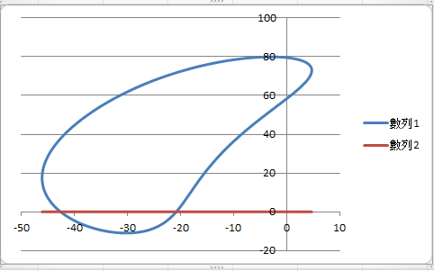
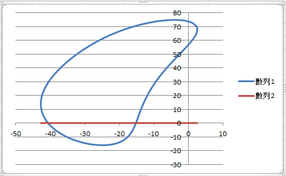
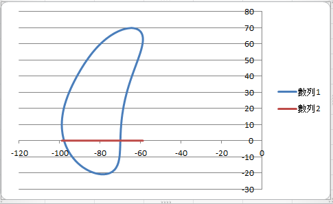
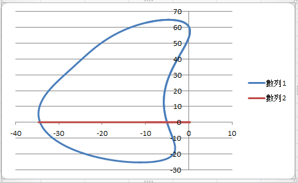
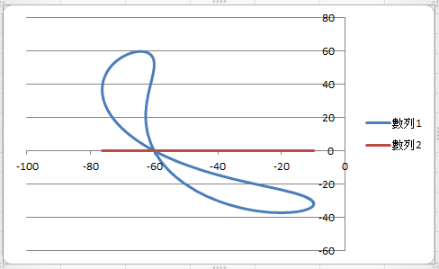
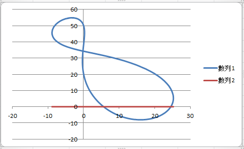
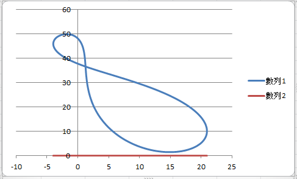
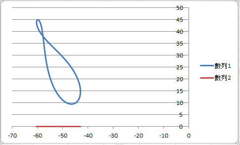

Title: 20170419第九週
Date: 2017-04-19 10:10
Category: Course
Tags: python, solvespace
Slug: Week 9
Author: 2017springcd_bg8

第1位組員(40423214)負責 Length=50 的四連桿分析。

第2位組員(40423216)負責 Length=45 的四連桿分析。

第3位組員(40423225)負責 Length=40 的四連桿分析。

第4位組員(40423234)負責 Length=35 的四連桿分析。

第5位組員(40423242)負責 Length=30 的四連桿分析。

第6位組員(40423244)負責 Length=25 的四連桿分析。

第7位組員(40423247)負責 Length=20 的四連桿分析。

第8位組員(40423250)負責 Length=15 的四連桿分析。

